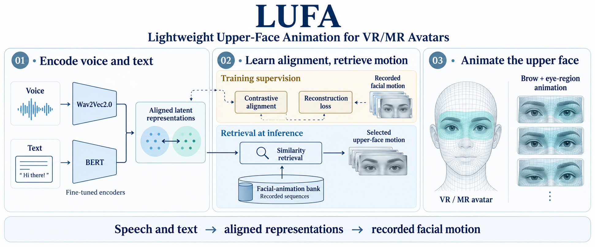
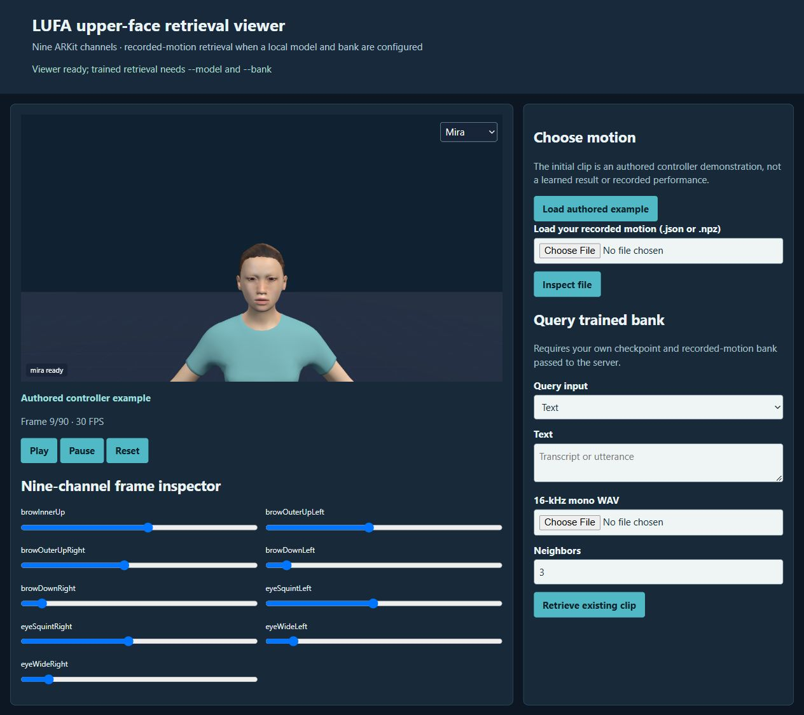

# LUFA: Lightweight Upper-Face Animation for VR/MR Avatars

**Hwang Youn Kim, Ghazanfar Ali, Jae-In Hwang**

**IEEE ISMAR-Adjunct · 2025** · Published

[Paper / publisher](https://doi.org/10.1109/ismar-adjunct68609.2025.00217) · [Project page](https://ghazanfarali.com/research/lufa/) · [BibTeX](citation.bib) · [Requirements](REQUIREMENTS.md) · [Code & setup](#implementation-and-usage)

> Lightweight upper-face animation for VR and MR avatars.



*Graphical abstract diagram. Aligned speech and text representations support recorded facial-motion retrieval.*

## Why this research

Upper-face movement contributes to a conversational avatar's expressiveness, but large generative models can be costly. LUFA explores retrieving existing facial motion through representations aligned with voice and text.

LUFA encodes voice and text with fine-tuned Wav2Vec2.0 and BERT models. Reconstruction loss and contrastive learning align latent representations, which are used to retrieve facial-animation sequences for VR and MR avatars. The related journal manuscript studies a later emotion–liveness approach and is in final review.

## Method at a glance

**Voice + text** → **Aligned latent representations** → **Facial animation retrieval**

| | Research system |
|---|---|
| Input | Voice and text |
| Method | Wav2Vec2.0 and BERT encoders; reconstruction loss; contrastive latent alignment and retrieval |
| Output | Retrieved upper-face facial-animation sequences |

## Evidence and scope

Consult the full conference paper for evaluation details

**Attribution:** These findings describe the paper or manuscript, not results obtained with this repository's code.

**Study context:** Conference abstract describes the representation and retrieval framework.

**Limitations:** Retrieval selects existing animation sequences. The later emotion–liveness manuscript’s parameter counts and study results do not describe LUFA.

## Explore the implementation

Audio/text fine-tuning, reconstruction and contrastive objectives, BEAT clip preparation with speaker-disjoint splits, bank building and recorded facial-clip retrieval, which the browser viewer serves once a local model and bank exist. Architecture details absent from the accessible abstract are explicitly assumed.

This repository contains independently written research code. The institute's original source, datasets and trained models are not distributed. Public-data preparation, commands, assumptions and checks are documented below and in [REQUIREMENTS.md](REQUIREMENTS.md).

## Resources and citation

Read the paper through its [publisher record](https://doi.org/10.1109/ismar-adjunct68609.2025.00217). PDFs are hosted by publishers or preprint archives rather than stored in this repository.

Please cite the research paper when using its ideas; [download the BibTeX citation](citation.bib). The implementation has its own documented scope.

<!-- demo-preview:start -->
## Demo preview



*Local demo with small starter examples; the capture illustrates the interface, not a reproduced paper benchmark.*

From the repository root, using the Python environment described below:

```sh
python -m pip install -e .
python scripts/start_demo.py
```

Open **http://127.0.0.1:8080/**. When a trained checkpoint (`outputs/lufa/model/`) and a recorded-motion bank (`outputs/lufa/bank.npz`) exist, the launcher serves learned retrieval over recorded BEAT face clips; `python scripts/start_demo.py --train-small` prepares local BEAT takes, trains a small from-scratch model and builds that bank first (see the BEAT-first setup below). Otherwise click **Play** to animate the automatically loaded nine-channel authored face example, or adjust its channel controls. The launcher selects the bundled inputs automatically. Avatar demos prepare their pinned Three.js modules on first launch, so that step needs internet access. Model weights and public datasets are optional for the starter workflow and are prepared separately for real-data use.

The 3D presentation uses shared Three.js avatar components and bundled fictional CC0 characters. The paper-specific algorithms and data adapters live in this repository.

<!-- demo-preview:end -->

## Implementation and usage

<!-- implementation-guide -->

Hwang Youn Kim, Ghazanfar Ali and Jae-In Hwang, **IEEE ISMAR-Adjunct 2025**, pp. 841–842. [Paper DOI](https://doi.org/10.1109/ISMAR-Adjunct68609.2025.00217) · [Paper page](https://ghazanfarali.com/research/lufa/).

This independent research baseline fine-tunes **Wav2Vec2.0 and BERT** using motion reconstruction and contrastive audio/text alignment, then retrieves an existing upper-face animation from a local bank. The reconstruction heads supervise training; they do not synthesize motion at inference.

The indexed conference abstract was available; the full PDF was not supplied locally or accessible during implementation. [REQUIREMENTS.md](REQUIREMENTS.md) distinguishes abstract-supported components from our choices: pooled 128-dimensional latents, symmetric InfoNCE,90 × 9 reconstruction heads, BEAT data, and equal-weight multimodal retrieval. This does **not** reuse or claim the later emotion–liveness manuscript's architecture, metrics or timing.

### BEAT-first setup (learned retrieval on public data)

Install PyTorch for your platform, then the package. The commands below fetch three small official BEAT takes (WAV, ARKit face JSON and word TextGrid, each file capped at 25 MB) into ignored `outputs/beat-raw/`, train a compact from-scratch model on CPU, build the recorded bank and open the viewer on learned retrieval:

```sh
python -m pip install -e .
lufa fetch-beat --speaker 1 --takes 1_wayne_0_1_1 1_wayne_0_2_2 1_wayne_0_3_3 --output outputs/beat-raw
python scripts/start_demo.py --train-small
```

`--train-small` runs `lufa prepare-beat` on `--beat-root` (default `outputs/beat-raw`), trains for `--epochs` (default 6; about a minute on a laptop CPU for these three takes), builds the bank and records a provenance note shown in the viewer. Later runs of `python scripts/start_demo.py` reuse the result. The launcher chooses learned retrieval whenever both default (ignored) locations exist:

| Path | Produced by |
|---|---|
| `outputs/lufa/model/` (`model.pt`, `tokenizer/`) | `lufa train --output outputs/lufa/model` |
| `outputs/lufa/bank.npz` | `lufa bank --output outputs/lufa/bank.npz` |

Pass `--model`/`--bank` for other locations. Without both files, or with `--authored`, it starts the labelled authored controller example. The small demo model is trained from scratch on one speaker, a few minutes of speech; it shows the learned path working, not the paper's model quality.

For a full run, download BEAT English v0.2.1 following its [official access instructions](https://github.com/srymurphy/BEAT) (Hugging Face dataset `H-Liu1997/BEAT`, folder `beat_english_v0.2.1/<speaker>/<take>.{wav,json,TextGrid}`) and prepare every speaker:

```sh
lufa prepare-beat --root /path/to/beat_english_v0.2.1 --output data/beat
lufa train --manifest data/beat/manifest.jsonl --audio-model data/encoders/wav2vec2 --text-model data/encoders/bert --output outputs/lufa/model --device cuda
lufa bank --manifest data/beat/manifest.jsonl --model outputs/lufa/model --output outputs/lufa/bank.npz
lufa evaluate --manifest data/beat/manifest.jsonl --model outputs/lufa/model --bank outputs/lufa/bank.npz --split test
python scripts/start_demo.py
```

`prepare-beat` walks the layout and pairs same-stem WAV, face JSON and TextGrid files. It reads the TextGrid `words` tier and cuts 3-second windows; `--hop` (default 3 s) sets the stride and starts are snapped to word onsets unless `--no-snap`. A word belongs to the window containing its midpoint. Windows with fewer than `--min-words` words (default 1) are skipped. Each window writes a 16-kHz mono 16-bit WAV crop, the native 60-fps `[T,9]` face crop (selected by each frame's JSON `time`, clipped to [0,1]) and its transcript. `--window` is configurable only within the training contract (2.94–3.06 s).

Splits are speaker-disjoint. A seeded ~10 %/10 % of speakers go to validation/test, or you can name them with `--validation-speakers`/`--test-speakers`. Speakers can be selected by id or name (`--speakers 1 2 scott`).

BEAT's scripted readings repeat the same text across speakers. Repeated and near-repeated transcripts (exact match, or word-set Jaccard ≥ `--dup-threshold`, default 0.6) share a `text_group`, and `repeated_text` is set on them. By default `train` uses group-aware batches, so two clips of one group never act as each other's contrastive negatives. `--duplicates drop` instead keeps one clip per group and split. `prepare-summary.json` records counts of skipped windows, clipped weights and repeats.

### Immediate 3D channel demo

```powershell
python -m venv .venv
.venv\Scripts\Activate.ps1
python -m pip install -e .
python scripts/prepare_viewer.py
lufa serve
```

Open `http://127.0.0.1:8767`. Without `--model`/`--bank` the first clip is an authored controller example for the nine brow/eye channels, not a trained retrieval result. With a checkpoint and bank the first clip is a learned text-query retrieval (`--demo-text` sets the query).

### Detailed setup and local encoders

Python 3.10+. Install a suitable [PyTorch build](https://pytorch.org/get-started/locally/), then:

```powershell
python -m venv .venv
.venv\Scripts\Activate.ps1
python -m pip install -e .
lufa --help
```

On Linux/macOS activate with `source .venv/bin/activate`. Obtain Wav2Vec2 and BERT model/tokenizer files yourself, following [Wav2Vec2 documentation](https://huggingface.co/docs/transformers/model_doc/wav2vec2) and [BERT documentation](https://huggingface.co/docs/transformers/model_doc/bert), respecting each checkpoint's terms. Place them in local directories. The code uses `local_files_only=True` and performs no implicit downloads. Supply a BERT tokenizer consistent with your text language and checkpoint vocabulary.

`--from-scratch` constructs compact random four-layer Wav2Vec2/BERT encoders (an explicit baseline alternative to pretrained fine-tuning). It needs either a **local BERT tokenizer** (`--text-model`) or `--corpus-vocab`, which builds a small lowercase WordPiece vocabulary from the training transcripts, with character fallback for unseen words. No pretrained encoder weights are needed, and no model files are bundled here.

### Synthetic quickstart

After installation, run `python scripts/verify.py`. It creates two aligned three-second WAV/motion records, loads them through the production manifest and batching code, performs one CPU optimization step with small randomly initialized Wav2Vec2/BERT configurations, saves and reloads a production-compatible checkpoint, builds a bank, and retrieves a recorded motion. Inspect the model, bank, and `retrieved-face.npz` under `outputs/verify/`. It needs no network or model download. For real training, retain the manifest, WAV, transcript, and `[T,9]` motion contracts below, then point the CLI at local pretrained encoders or use `--from-scratch` with your local tokenizer.

### Public dataset preparation

Obtain synchronized speech, transcript and ARKit facial motion from [BEAT](https://github.com/srymurphy/BEAT) using its official access instructions. Versions, access conditions and channel formats vary. Do not redistribute recordings or generated banks merely because the source repository is public. MEAD could be an alternative after AU extraction/retargeting, but BEAT's recorded blendshapes avoid that extra estimation step.

`lufa prepare-beat` (above) produces the clip contract below automatically. For other data, prepare approximately 3-second **aligned** clips yourself: 16-kHz mono signed 16-bit PCM WAV (47000..49000 samples), transcript of exactly that window, and `[T,9]` float32 motion 0..1 in this order:

```text
browInnerUp, browOuterUpLeft, browOuterUpRight, browDownLeft, browDownRight,
eyeSquintLeft, eyeSquintRight, eyeWideLeft, eyeWideRight
```

Use FFmpeg for waveform conversion (`ffmpeg -i input.wav -ar 16000 -ac 1 -c:a pcm_s16le output.wav`) and timed transcripts to choose windows. Do not pair a whole recording's transcript with a short motion crop. Motion is resampled to 90 frames; this preserves the chosen crop's endpoints but does not perform timestamp alignment. Audio/motion/transcript synchronization is your preparation responsibility.

An adapter accepts BEAT named-channel JSON `{"names":[...],"frames":[{"weights":[...],"time":...}]}` and exports a 90-frame nine-channel clip. It measures the input's duration from the frame `time` values (60 fps when absent). Inputs longer than `--max-seconds` (default 3.5 s) are refused instead of being silently time-compressed. Crop with `--start/--end`, or pass `--allow-resample` to compress deliberately. Values outside [0,1] are clipped with a warning:

```powershell
lufa convert-motion --input data/clips/clip-face.json --output data/clips/clip-face.npy
lufa convert-motion --input 1_wayne_0_1_1.json --start 1.35 --end 4.35 --output data/clips/wayne-001-face.npy
```

Write `data/manifest.jsonl` (paths relative to manifest; one record per line):

```json
{"id":"beat-a-001","speaker":"speaker-a","split":"train","text":"the transcript of this clip","wav":"clips/a-001.wav","motion":"clips/a-001-face.npy"}
{"id":"beat-b-001","speaker":"speaker-b","split":"test","text":"another aligned transcript","wav":"clips/b-001.wav","motion":"clips/b-001-face.npy"}
```

These examples describe the schema; files are not included. `prepare-beat` adds optional `take`, `script`, `start`, `end`, `text_group` and `repeated_text` fields. Use at least two training records for contrastive negatives. Keep speakers disjoint across train/validation/test; the loader rejects overlap and duplicate clip ids. WAV is standardized per clip; tokenizer padding and Wav2Vec2 convolution output masks are excluded from pooled representations. Padded audio is zeroed. Following the Hugging Face guidance, the Wav2Vec2 attention mask goes only to layer-norm feature extractors (for example `wav2vec2-large-lv60`); group-norm checkpoints (for example `wav2vec2-base`) and the `--from-scratch` encoder receive zero-padded input without one.

### Train, build a bank, retrieve

```powershell
lufa train --manifest data/manifest.jsonl --audio-model data/encoders/wav2vec2 --text-model data/encoders/bert --epochs 20 --batch-size 8 --output runs/lufa --device cuda
# Optional alternative: random compact encoders plus a local tokenizer
lufa train --manifest data/manifest.jsonl --text-model data/encoders/bert --from-scratch --output runs/lufa-random --device cuda
lufa bank --manifest data/manifest.jsonl --model runs/lufa --output runs/bank.npz --device cpu
lufa retrieve --model runs/lufa --bank runs/bank.npz --text "I am pleased to see you" --output outputs/face.npz
lufa retrieve --model runs/lufa --bank runs/bank.npz --wav data/query.wav --text "I am pleased to see you" --top-k 3 --frames 120 --output outputs/face-long.npz
lufa evaluate --manifest data/manifest.jsonl --model runs/lufa --bank runs/bank.npz --split test
```

Training defaults (20 epochs, 2e-5 AdamW, temperature .07) are implementation assumptions. All encoder parameters are trainable. Singleton final batches are skipped because they have no contrastive negatives. CPU execution is supported as a code path; full fine-tuning can be expensive.

The bank contains normalized fused embeddings, recorded 90 × 9 motions, clip ids and speaker ids from **training records only**. Query can use audio, text or their normalized average. Retrieval copies the highest-scoring clip; `--frames` optionally interpolates to caller length. Output NPZ includes motion/names/fps, and adjacent JSON records top-k ids and cosine similarities. This preserves recorded motion rather than decoding an average expression.

Evaluation rejects held-out speaker overlap with checkpoint/bank speakers and reports motion MAE plus the best possible bank MAE against each reference. These are diagnostics, not the paper's reported evaluation or evidence of perceived naturalness. A semantically valid retrieved expression can differ from the single reference.


### Local 3D face viewer and recorded retrieval

The local viewer uses an original procedural Three.js character. Without a configured checkpoint and bank, its first motion is an **authored controller example** that exercises the nine brow/eye channels; it is synthetic and says nothing about the trained model. **Load authored example** shows it in either mode. Run `python scripts/prepare_viewer.py` once to download pinned Three.js 0.170.0 into ignored `static/vendor/`, then:

```powershell
lufa serve
```

Open http://127.0.0.1:8767. The viewer can play the authored channel sequence, inspect each channel manually, and upload your own recorded `.npz` or named-channel `.json` through the local API. NPZ uses `motion: [T,9]`, optional `names` in the exact documented order, and optional `fps`. JSON uses `motion: [[...nine values...], ...]` in the exact order, or BEAT-style `names` plus `frames: [{"weights": [...]}]`; the latter is reordered by channel name. Values must be finite and in `[0,1]`. Uploaded motion is held only for the active page response, not added to the bank.

To run **actual learned retrieval**, first train a local checkpoint and build a bank with the commands above, then restart the viewer:

```powershell
lufa serve --model runs/lufa --bank runs/bank.npz --device cpu
```

Choose text, a 16-kHz mono WAV file, or both. The API calls the saved encoders through `load_model` and `query`, loads the bank through `read_bank`, ranks with `nearest`, and returns the existing recorded clip plus ranked clip IDs/speakers/cosine scores. The browser does not train or download any model. No weights, dataset clips, banks, or original avatar assets are distributed. The viewer is a channel playback aid, not a claim of reproduced visual quality or paper latency.

<!-- avatar-recorded-motion:start -->
## Bundled characters and recorded public motion

The browser demos include Rowan and Mira, two new fictional GLB characters built with MPFB and MakeHuman community assets under CC0 1.0. See [avatar licensing and provenance](static/avatars/LICENSE.md). Use the character selector in the stage. The shared renderer supports body bones, ARKit facial channels, and approximate speaking motion.

Recorded motion is adapted to the characters' proportions. Palm landmarks set hand orientation; finger curl uses bounded hinge bends and preserves the character's finger spacing. Thumb-base opposition stays in the authored pose, with conservative recorded curl at the remaining joints. Distal bends are estimated from the preceding joint when fingertip landmarks are absent. Use the companion's hand close-up views to inspect the result.

The [avatar motion companion](static/recorded-motion.html) opens at `/static/recorded-motion.html` while the demo server is running. A small authored motion and face sample loads automatically; click **Play** without uploading files. It also plays locally selected BEAT motion, face, and WAV files on the bundled characters. These are presentation and data-inspection tools, separate from the paper implementation. No BEAT recording, dataset archive, or trained model is bundled. For recorded public motion, install the one preparation dependency and fetch a small official sample into ignored `outputs/beat-demo/`:

```sh
python -m pip install numpy
python scripts/beat_demo/fetch_modalities.py --speaker 1 --sequence 1_wayne_0_1_1 --include-bvh --max-bytes 25000000 --output-dir outputs/beat-demo/source
python scripts/beat_demo/prepare_bvh.py --bvh outputs/beat-demo/source/1_wayne_0_1_1.bvh --output outputs/beat-demo/sample/1_wayne_0_1_1-raw-motion.json --frames 120
python scripts/beat_demo/prepare_modalities.py --sequence 1_wayne_0_1_1 --source outputs/beat-demo/source --output outputs/beat-demo/sample --frames 120
```

Open the companion and select `outputs/beat-demo/sample/1_wayne_0_1_1-raw-motion.json`, `1_wayne_0_1_1-face.json`, and `1_wayne_0_1_1.wav`. The downloader caps each original file at 25 MB; the prepared clip contains up to 120 frames. The viewer uses local files and does not upload them. For other BEAT takes, substitute a matching official speaker and sequence ID.

If you already have OmniMo's processed 52-joint Unity humanoid data, use that normalized motion instead:

```sh
python scripts/beat_demo/prepare.py --dataset /path/to/processed/beat --speaker 1 --take 1_wayne_0_1_1 --output outputs/beat-demo/sample/1_wayne_0_1_1-motion.json --max-frames 120
```

Select the resulting `*-motion.json` in the companion. Its metadata carries the humanoid joint mapping and source-to-avatar coordinate conversion. The viewer fits source FK directions from the avatar's bind pose, following the spine explicitly at branching joints. This avoids applying incompatible source bone twist to the MPFB skin; it does not reproduce exact performer twist. The adapter supports Unity proximal/intermediate/distal finger names. Raw BVH remains a public-data alternative; do not mix the two skeleton conventions.
<!-- avatar-recorded-motion:end -->

## License

Code is MIT licensed; see [LICENSE](LICENSE). The bundled fictional characters and authored starter fixtures keep their CC0 1.0 dedication, and datasets or models you download keep their own licences.
